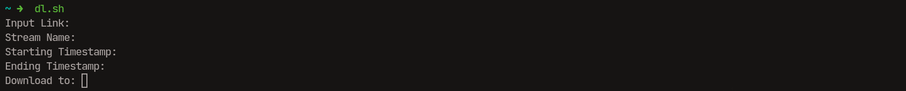
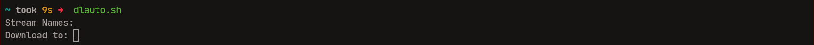

# easydl
A quick script to download Youtube clips via ffmpeg and youtube-dl

## Dependencies
- youtube-dl
- ffmpeg

## How to Use
There are two scripts, `dl.sh` being the manual version where you download one video at a time by providing a link, streamname and timestamp(s) and `dlauto.sh` being the automatic version that requires you provide at least one txt file (see [sample.txt](./sample.txt))
If you don't want to place the script in the project folder just make sure that it is in one of the directories in your path variable.

### Manual (dl.sh)
`dl.sh` works by inputting a relevant Youtube link, followed by the desired stream name (this will also be the final name of the video), a starting timestamp and an optional ending timestamp. If the ending timestamp is not provided, the script will default to downloading the video until 10 seconds after the starting timestamp.

Once all the prompts are input, youtube-dl and ffmpeg will run in the background. The final downloaded video will be downloaded to the current directory formatted as `streamname_timestamp.mkv`. The video output can be changed as you like but that's beyond the scope of this README. Documentation can be found in the ffmpeg documentation or on forums.

### Automatic (dlauto.sh)

`dlauto.sh` works by first creating at least one text file, with the first line being the link to the Youtube stream and the subsequent lines (line 2 onwards) being any relevant timestamp either formatted as HH:MM:SS or in seconds from the start of the stream.

The script will simply prompt you for all the relevant names. Make sure to get this right or else the script might crash on the wrong file name (which is annoying but not a big deal).

Because of the way the script is coded, the filename needs to be same as the desired stream name/final name of the video. Suggestions are made within the script if you wish to do otherwise.

Similar to the `dl.sh` script, the final videos are formatted as `streamname_timestamp.mkv` and output in the current directory.

## Things to Note

Note that by nature ffmpeg isn't great with specific timestamps, so you can only really do up to the nearest second and make the edits in post yourself. You could let ffmpeg do more tight timestamps but that isn't within the scope of what I needed to do, so it's both a limitation of my use case and ffmpeg.

This script works mainly on Unix systems; in order to use them for Windows systems you'll need to make sure any '/' in the scripts are replaced with '\'. However, alternative .bat files exist for Windows and other software as well so it shouldn't be a problem.
